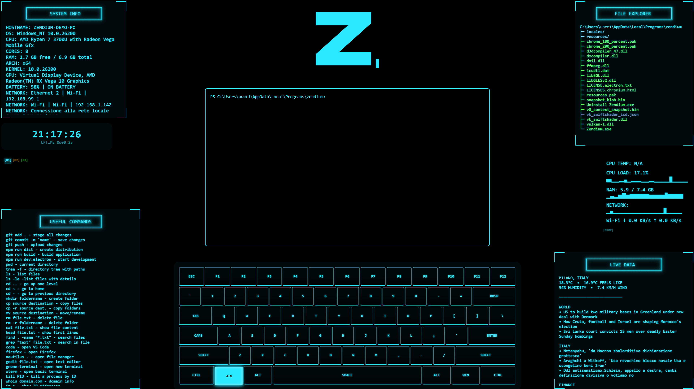
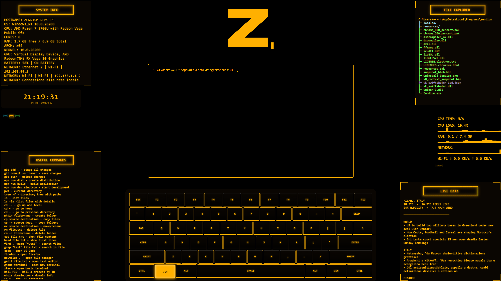
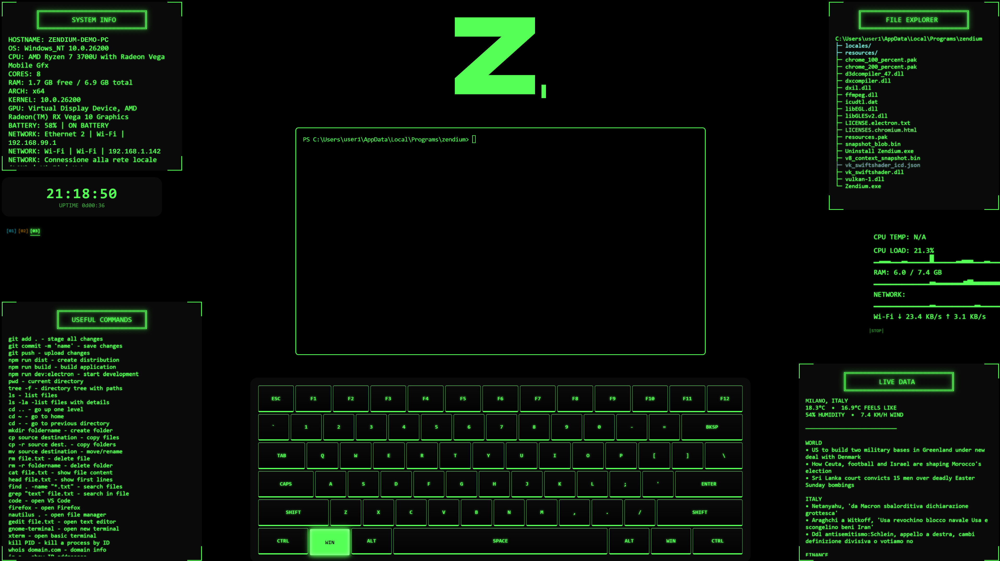

# Zendium


Zendium - Boot & Desktop App. A cyberpunk-style desktop environment and
dashboard built with Electron, React, Vite and TypeScript, for system
monitoring, file browsing and real-time data. Primary target: Linux (Ubuntu);
Windows is also supported.

## Features

- **Boot sequence:** about 30 seconds of sci-fi style boot screens, fully
  skippable
- **System info:** real-time hardware monitoring (CPU, RAM, GPU, network,
  battery) via `systeminformation`
- **Terminal:** integrated terminal powered by `@xterm/xterm` and `node-pty`
- **File explorer:** read-only navigation of the local file system
- **Live widgets:** weather, news and dynamic system metrics
- **Themes:** 3 built-in color themes

## Known limitations (Windows)

- CPU temperature reading does not work.
- The file explorer does not follow directory changes made in the terminal
  (it does on Linux).

## Download

Installers are available on the [Releases page](../../releases):

- **Linux:** AppImage
- **Windows:** NSIS installer

## Run from source

Requirements:

- **Node.js** (v18 or higher) and **npm**
- Build tools for the native module `node-pty` (Linux: `python3`, `make`,
  `g++`; Windows: Visual Studio Build Tools with the C++ workload)

```bash
git clone <https://github.com/edoardosartori/Zendium.git>
cd Zendium
npm install
npm run dev:electron   # Vite + Electron on localhost:8080
```

To start only the Vite dev server: `npm run dev`

## Build

Packages are generated with `electron-builder` in the `release/` directory:

```bash
npm run dist    # compile and package
npm run build   # compile static assets only with Vite
```

## Privacy

Zendium runs entirely on your machine: system data, terminal activity and
file browsing never leave your computer. The only network requests are the
ones needed to fetch news and weather.

## Status

Completed. This project is no longer maintained or updated
(last update: September 2026).
This README was written with the assistance of AI.



